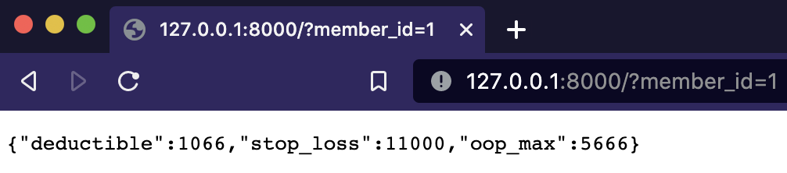

# Nirvana Test API

Project developed using Python 3.8.1. Run pip for dependencies and start the app:

```bash
pip install -r requirements.pip
uvicorn main:app --reload
```



Things taked into account:

- Given that future behaviours could be applied to the coalesce API the strategy desing pattern was used (see [strategies.py](strategies.py)). By default, average strategy is used

- For faster development and scope of the project FastApi was selected

- Application performance is mostly leveraged with Asyncio and Aiohttp. Applying parallel requests (1 to 1 coroutines) to each endpoint

- [Httpbin](https://httpbin.org/) to run a full example

- Tests can be run using `pytest`

Further improvements:

- Functional tests for each of the created strategies and all async methods

- A more generic approach for async requests

- Error handling

- Docker image
